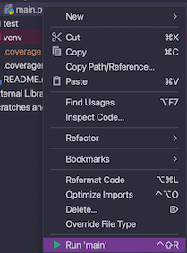

# THE MAZE

**THE MAZE** is a program that creates mazes, allows you to try to solve them, and
solves the mazes using different algorithms. Optionally you can choose to view the
maze generation and solving processes live in a GUI.

**CLICK THE IMAGE BELOW TO VIEW THE MAZE IN ACTION AT YOUTUBE!!!**

[](https://youtu.be/y9F6p5_Q7lU)

## RUNNING THE PROGRAM

In root folder, run

`python3 main.py`

OR alternatively:

- Download the [PyCharm IDE](https://www.jetbrains.com/pycharm/download/#section=mac) if you don't have it already.
- Download this repository.
- Open this project in PyCharm.
- Find the file src/main.py in the source file tree.
- Click once with left mouse button so that the file becomes selected.
- Click once with right button to see the context menu (see the image below).
- Select option Run 'main'.
- A console program will start and print out the use instructions.
- Answer the questions asked by the console.
- A GUI will open up. Follow the instructions within the GUI.
- DO NOT CLICK WITH A MOUSE (even outside the GUI) AT ANY POINT!
- Be patient and have fun!



**NOTE:**
If you get the below warning (and the GUI does not open up properly),
switch to using python version 3.10.2 as the interpreter in PyCharm.
This python version should enable the Turtle graphics (needed by the graphical UI).

```
DEPRECATION WARNING: The system version of Tk is deprecated and may be removed in a future release.
Please don't rely on it. Set TK_SILENCE_DEPRECATION=1 to suppress this warning.
```

## RUNNING THE TESTS

- Please note that running the tests takes some time (as we wait for the events to be dispatched properly)!
- Files containing tests have been placed near the code that they test.
- To run all tests, open a separate Terminal (macOS) at root level and run
  `python3 -m pytest`
  (If you wish to see the print logs, add -s to the command).
- To run a single test file, run (change the folder and file names as necessary)
  `python3 -m pytest src/maze_parameters/parameters_test.py`
- To get test coverage data, run
  `coverage run -m pytest`
  and then print the test coverage data to console with
- Currently there are no tests for the GUI graphics (only the console and algorithms are tested).

```
coverage report -m
```

or create an HTML-file with

```
coverage html
```

followed by opening the generated [html file in path htmlcov/index.html](htmlcov/index.html) with your browser.

## ALGORITHMS

### Maze generation

To generate mazes the [Twist & Merge algorithm by Bellot et al. (2021)](https://www.sciencedirect.com/science/article/abs/pii/S0020025521002656) is used. This algorithm was chosen - despite its slowness - because the article in which it was described gave the impression that **Twist & Merge** produces mazes that are especially fun to play due to their being difficult enough and not having long corridors.

How do you perform the generation by Twist & merge?

1. First you "Twist". Select one untreated node (one cell or square in the N x N maze) in random (start node). Perform a random walk from this node. When walking to new nodes, create connections between them. Also, give all nodes of this walk the same label. According to the original article, a walk should end if a wall or an already treated node is encountered or if the new node would cause a long corridor to be formed. In the implementation in this program, a new node is picked randomly from among surrounding nodes (walls are not considered). Repeat selecting new untreated nodes and performing random walks until all nodes are treated (each node has a label meaning that each node belongs to some group). Note: in random walk, one cannot create long corridors (i.e. only two-node "corridors" are allowed).

2. Second you perform the "Merge". Select one group of nodes in random. Go through all members in this group in random order. For each member, check if there are unconnected neighbors with different labels that could be connected. If so, create a connection between the member under study and a random neighbor. Change the label of each member of the new group to be the same as is the label of the originally selected group. Go through all groups, so that in the end all nodes belong to one single group.

### Maze solving

Currently the following maze solving algorithms are available:

1. Wall follower
2. Dead End Filler
3. Dijkstra
